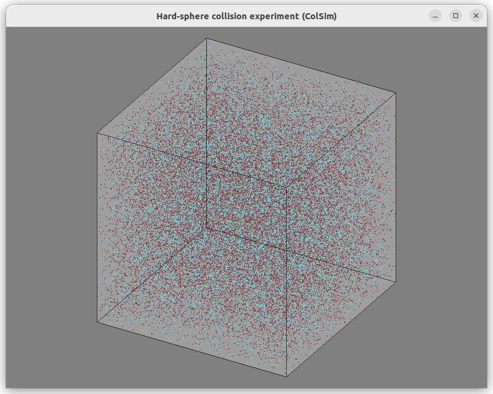
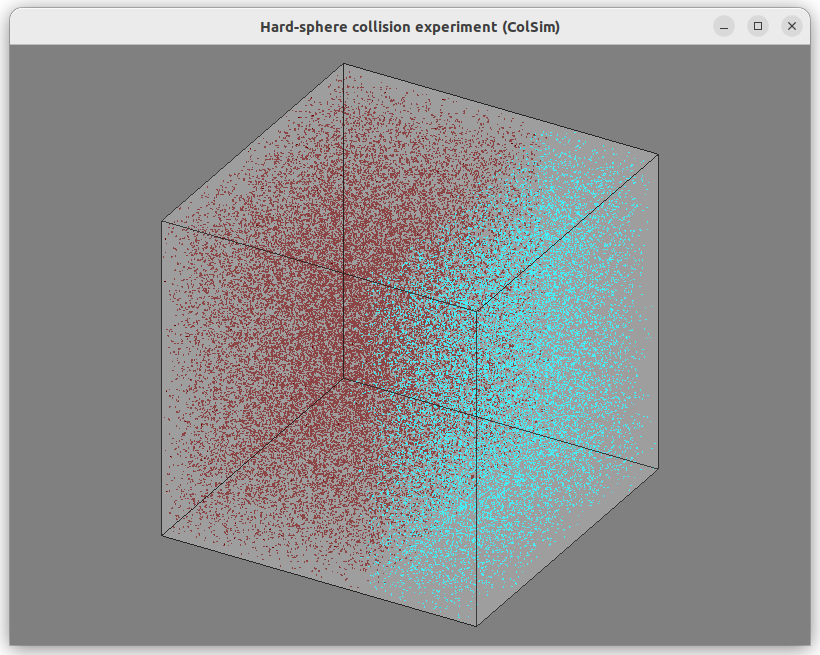
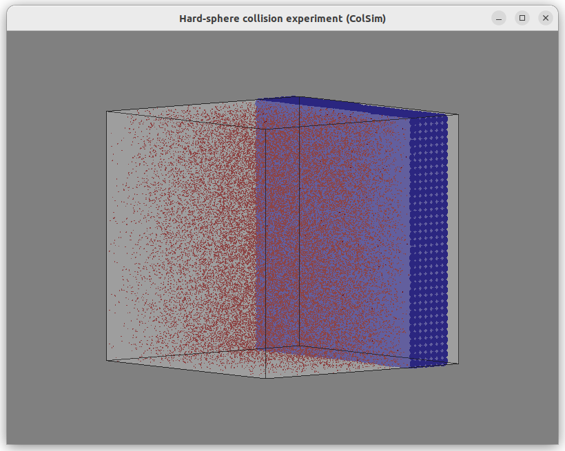
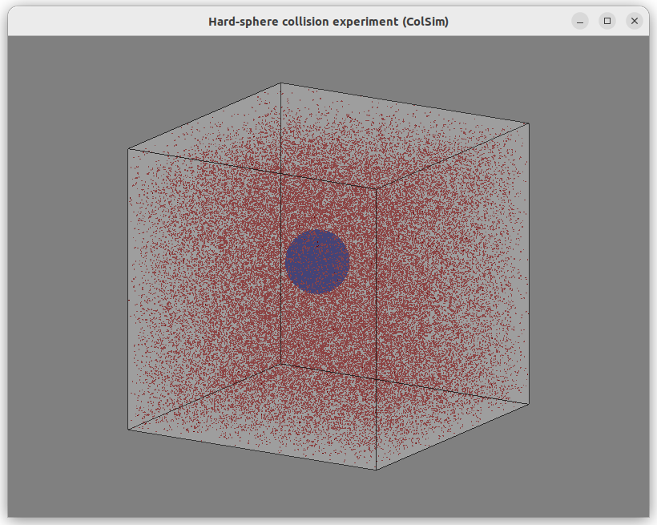

# ColSim
Hard-sphere collision experiment

#### Dependencies: 
- glfw3 (https://www.glfw.org/) [sudo apt-get install libglfw3-dev] 
- glm (https://www.opengl.org/sdk/libs/GLM/) [sudo apt-get install libglm-dev] 
- glade (https://glad.dav1d.de/) [visit the website and generate glad.c for your machine]

#### Execute:  
- ColSim.exe < Input.exp >& Output.csv

#### Examples:

1. Mixing \
   
3. Boundary layer \
   
4. Surface \
   
5. Sphere / Impurity \
   

